# 🔥🔥 Flutter Social App Concept 

Flutter representation of a Social App Concept i found in Uplabs.

Star⭐ the repo if you like what you see😉.

Images are from [Unsplash](https://unsplash.com)
## 📸 ScreenShots

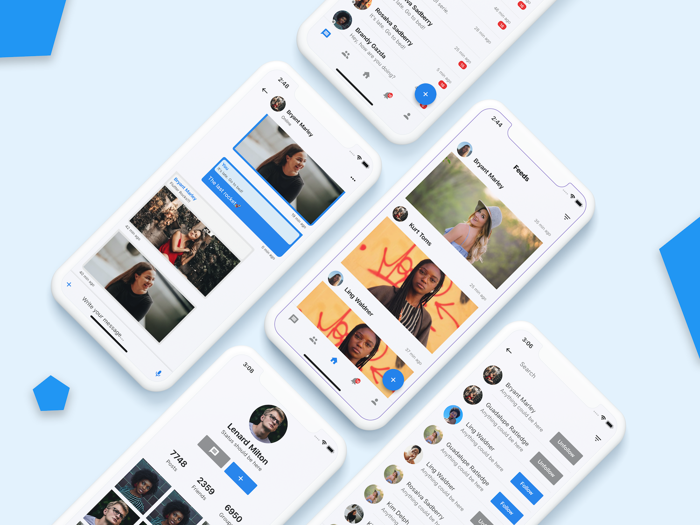
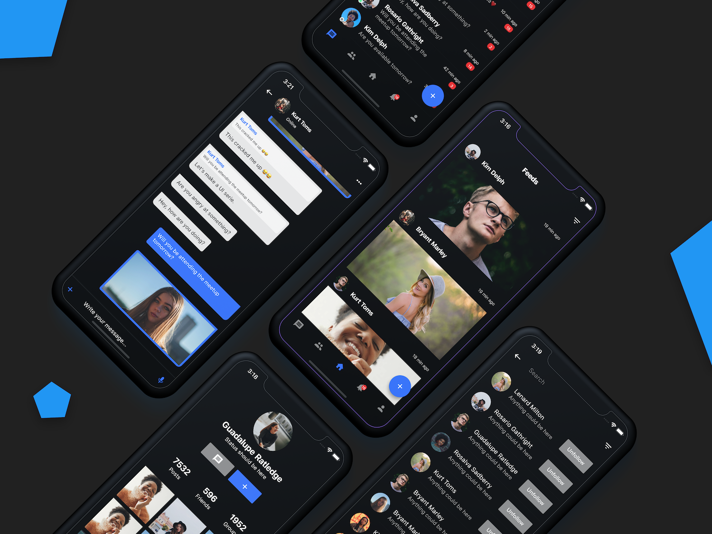

| 1 | 2|
|------|-------|
|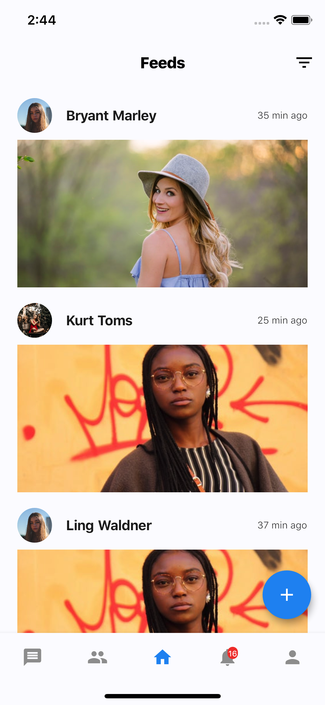|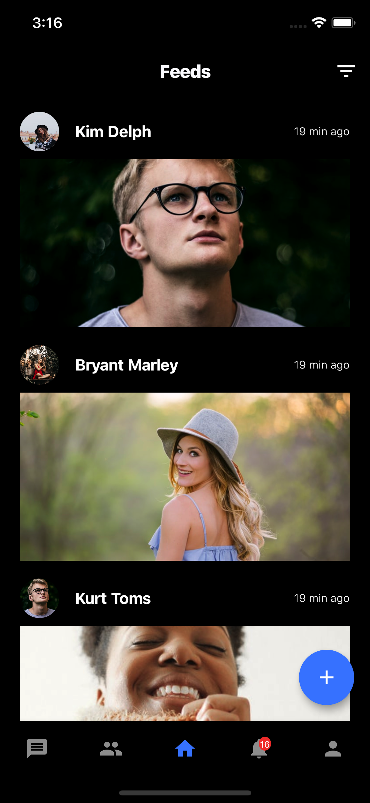|

| 3 | 4|
|------|-------|
|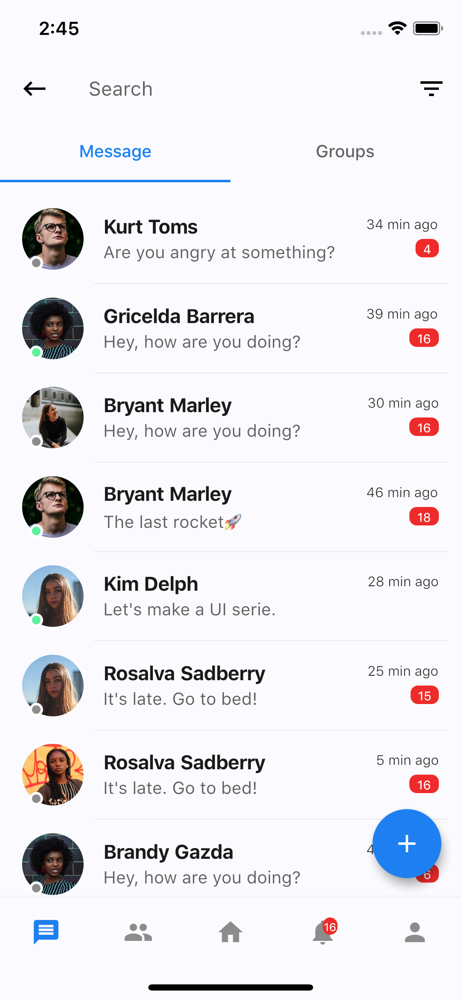|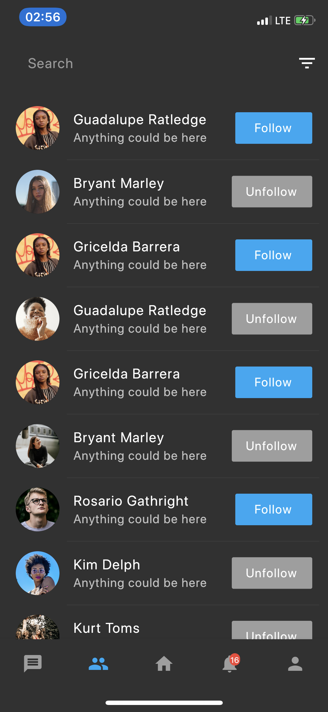|

| 5 | 6|
|------|-------|
|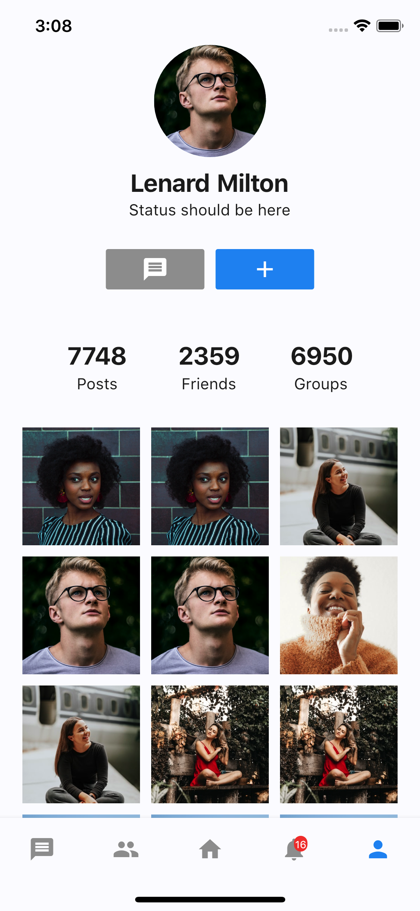|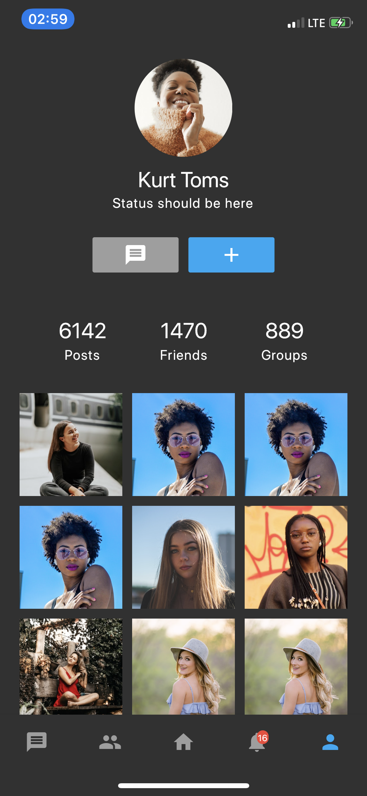|

| 7 | 8|
|------|-------|
|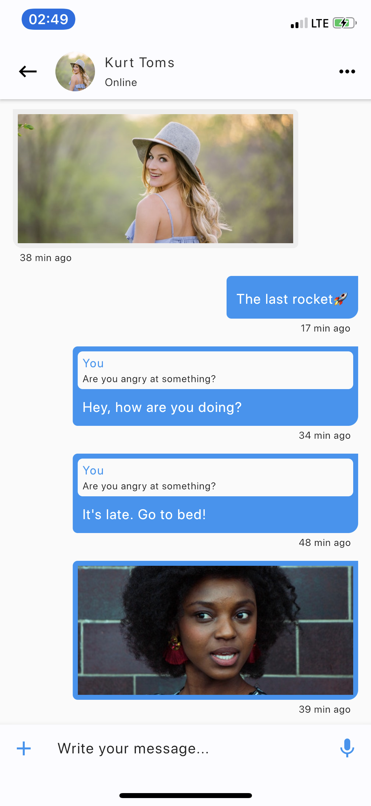|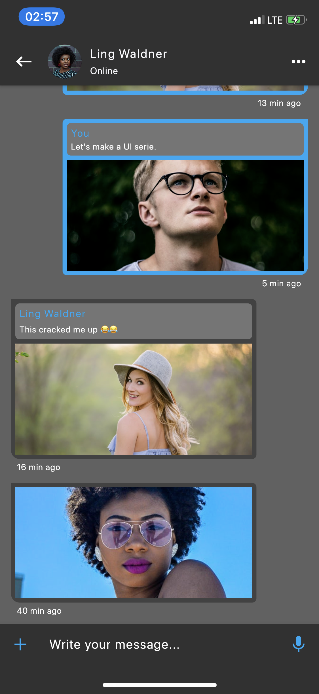|

| 9 | 10|
|------|-------|
|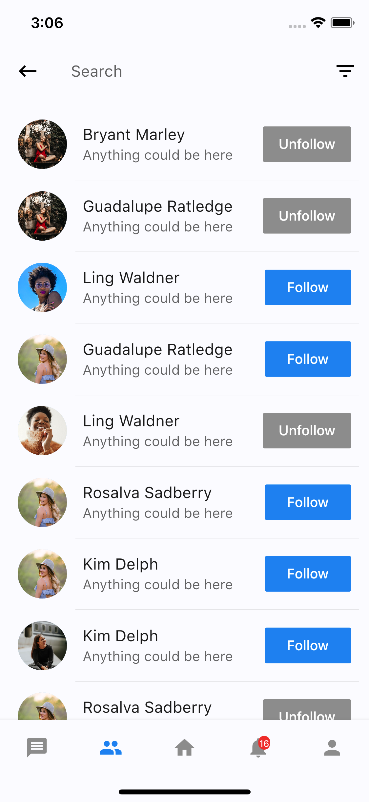||

| 11 | 12|
|------|-------|
|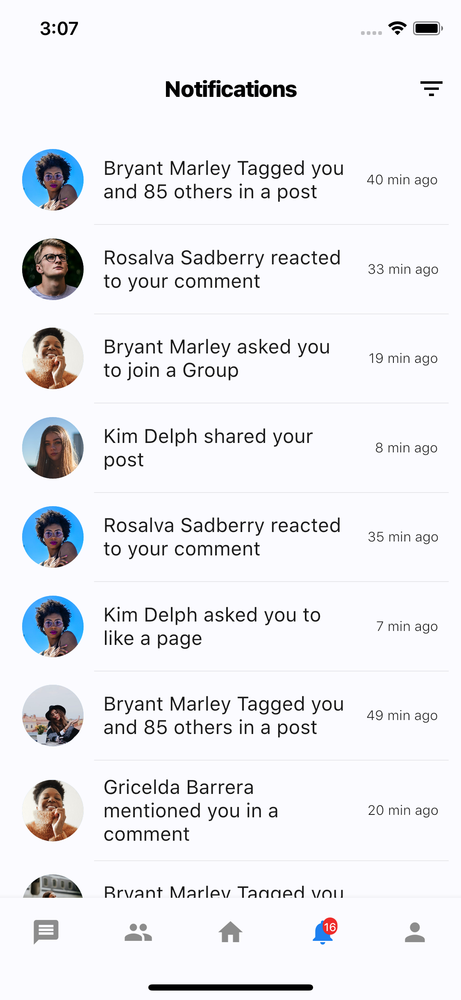||

## Toggle theme
To toggle the theme, change the `isDark` variable in `main.dart`.

`true` for dark and `false` for light.

## ✨ Requirements
* Any Operating System (ie. MacOS X, Linux, Windows)
* Any IDE with Flutter SDK installed (ie. IntelliJ, Android Studio, VSCode etc)
* A little knowledge of Dart and Flutter
* A brain to think 🤓🤓

## 🤓 Author(s)
**Olusegun Festus Babajide**

## Getting Started

This project is a starting point for a Flutter application.

A few resources to get you started if this is your first Flutter project:

- [Lab: Write your first Flutter app](https://flutter.io/docs/get-started/codelab)
- [Cookbook: Useful Flutter samples](https://flutter.io/docs/cookbook)

For help getting started with Flutter, view our 
[online documentation](https://flutter.io/docs), which offers tutorials, 
samples, guidance on mobile development, and a full API reference.

## LICENCE
[WTFPL](http://www.wtfpl.net/about/)